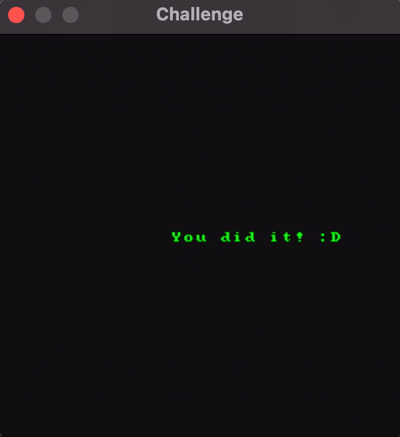

# Reverse-Engineering a C Graphics Library

<p align="center">
  
  <br><span>The renderer successfully initialized — displaying its embedded "You did it! :D" animation.</span>
</p>

This project is a case study in C-based **reverse-engineering**, completed as a test task for a JetBrains internship<sup><a href="#footnote1">[1]</a></sup>. The starting point was a single, pre-compiled "black-box" graphics library (`librender`) provided without any headers, documentation, or source code. The goal: analyze the binary and write a host application that can successfully interface with it.

---

## 🚀 Getting Started

### Prerequisites

- A C compiler (`cc` / `gcc` / `clang`)
- **macOS:** Cocoa and AudioToolbox frameworks (included with Xcode)
- **Linux:** `libX11` and `libasound` development packages

### Build & Run

```bash
git clone https://github.com/alx-sch/reverse.git
cd reverse
make
./run_renderer
```

The Makefile auto-detects your OS and links the appropriate pre-compiled library variant:

| Platform     | Library File              | Additional Linkage                            |
|:-------------|:--------------------------|:----------------------------------------------|
| macOS x86_64 | `librender_x86_64.dylib` | `-framework Cocoa -framework AudioToolbox`    |
| macOS ARM64  | `librender.dylib`        | `-framework Cocoa -framework AudioToolbox`    |
| Linux x86_64 | `librender_x86_64.so`    | `-lX11 -lasound`                              |
| Linux ARM64  | `librender.so`           | `-lX11 -lasound`                              |

---

## 🔍 The Challenge

Given only a compiled shared library with zero documentation, the objective was to:

- **Discover the API** — identify every exported function symbol from the binary
- **Deduce functionality** — determine what each function does, what arguments it expects, and what it returns
- **Reconstruct the internal state** — the library operates on an opaque data structure the caller must allocate; reverse-engineer its exact memory layout (size, fields, offsets)
- **Implement a working host** — write `main.c` to correctly allocate the state, initialize the renderer, drive the event loop, and handle cleanup

The final measure of success: the renderer opens a window and displays its embedded animation.

---

## 🧠 Approach & Methodology

The overall strategy was threefold:

1. What are the functions? (the API)
2. What data does the library need? (the struct)
3. In what order must the functions be called? (the logic in `main`)

### Step 1 — Symbol Discovery

Running `nm -g` on the `.dylib` to enumerate exported symbols:

```
[...]
0000000000001194 T _gfx_allocate_framebuffer
0000000000000d6c T _gfx_close
0000000000001124 T _gfx_create_context
0000000000001180 T _gfx_get_height_screen
0000000000001178 T _gfx_get_width_screen
0000000000001188 T _gfx_get_window_title
0000000000000770 T _gfx_init_context
0000000000000dac T _gfx_loop
00000000000011d4 T _gfx_render
0000000000001088 T _gfx_sleep
00000000000010e0 T _gfx_time
[...]
```

The `gfx` prefix confirms a graphics library. The function names alone reveal a clear lifecycle pattern: *create → init → loop/render → close*. The `gfx_get_*` helpers suggest the library itself knows the desired window dimensions and title — the host doesn't invent them, it asks the library.

### Step 2 — Decompilation & Struct Reconstruction

Ghidra<sup><a href="#footnote2">[2]</a></sup> (free!) was used to load `librender.dylib` into a new project. After the auto-analysis, the decompiled C code for each function revealed the struct layout piece by piece.

#### `gfx_create_context` — The Rosetta Stone

This function was the most informative starting point, as it's the constructor:

```c
// Ghidra's decompiled C
undefined8 *gfx_create_context(undefined8 *param_1, undefined4 param_2,
                               undefined4 param_3, undefined8 param_4)
{
    memset(param_1, 0, 0x430);
    *param_1 = param_4;
    *(undefined4 *)(param_1 + 1) = param_2;
    *(undefined4 *)((long)param_1 + 0xc) = param_3;
    return param_1;
}
```

Key deductions:

- **`memset(param_1, 0, 0x430)`** — the struct is exactly 0x430 = **1072 bytes**. This is the single most important discovery: the caller must allocate this size.
- Ghidra's `undefined8` and `undefined4` are 8-byte and 4-byte types respectively, meaning `param_1` is a pointer and `param_2` / `param_3` are `int`s.
- **`param_4`** → 8 bytes at offset 0x00 (later identified as the window title pointer)
- **`param_2`** → 4 bytes at offset 0x08 (window width)
- **`param_3`** → 4 bytes at offset 0x0C (window height)

#### `gfx_render` — Frame Buffer Location

```c
void *fb = *(void **)(param_1 + 0x10);   // Frame buffer at offset 0x10
```

A fourth field: a pointer to a frame buffer that the caller must allocate separately (width × height × 4 bytes for RGBA pixels).

#### `gfx_loop` — The Tricky One

The decompiled prototype threw a curveball:

```c
undefined4 gfx_loop(undefined8 param_1, double param_2, long param_3)
```

The confusion:
- `param_3` is used as an offset base (even though it's typed as `long`)?
- `param_1` is not used at all?
- `param_2` is somehow used as an offset for the mouse Y position?

Research reveals that decompilation is never 100% accurate — there was likely a parameter mislabeling mishap. This strongly implies that `param_1` *is* actually the state pointer and `param_3` is a decompiler artifact that can be safely ignored (passing `0L`).

Despite the confusion, the function body was clear about *what it writes* to the struct. Scanning for every `param_1 + 0x...` pattern across all `gfx` functions revealed the remaining fields:

- **Offset 0x18** — start of a keyboard state array (1028 bytes, covering key-down flags)
- **Offset 0x41C** — mouse X position
- **Offset 0x420** — mouse Y position
- **Offset 0x424** — mouse button bitmask (bit 0 set on press, cleared on release)
- **Offset 0x428** — pointer to the native window object (NSWindow on macOS)

The event-handling fields were identified using Apple's AppKit documentation for `NSEvent.EventType`<sup><a href="#footnote3">[3]</a></sup> and `NSWindow.contentView`<sup><a href="#footnote4">[4]</a></sup>. Since these fields aren't used externally, they could have been modeled as raw padding — but mapping them properly is good practice.

#### The Final Layout

```
Offset  Size    Field
──────  ──────  ──────────────────────────────
0x000   8       char *title
0x008   4       int windowWidth
0x00C   4       int windowHeight
0x010   8       void *frameBuffer
0x018   1028    char keyBoardState[1028]
0x41C   4       int mouseX
0x420   4       int mouseY
0x424   4       int mouseButtonState
0x428   8       void *windowPtr
──────  ──────  ──────────────────────────────
Total:  0x430 = 1072 bytes  ✓ matches memset
```

The sanity check: offset 0x428 + 8 bytes = 0x430, matching the `memset` size exactly. No padding or hidden fields remain.

### Step 3 — Host Implementation

With the struct and API fully mapped, writing `main.c` became a matter of getting the call order right.

#### The `gfx_allocate_framebuffer` Trap

A notable red herring: the library exports `gfx_allocate_framebuffer`, but decompilation reveals its `malloc` return value is never stored or passed anywhere. Calling this function would result in an immediate **memory leak**. The frame buffer must be allocated manually in `main.c` and placed at offset 0x10 before calling `gfx_init_context()`.

#### The Event Loop

```c
while (1)
{
    gfx_loop(g_state, 0.0, 0L);    // Process events (keyboard, mouse, window close)
    gfx_render(g_state, 1);         // Render frame; 1 = animate (scrolling text)
    gfx_sleep(0);                   // nanosleep with 0 → fast as possible without hogging CPU
}
```

- **`gfx_loop(state, 0.0, 0L)`** — keeps the window alive and handles the "close window" event. Other events (keyboard/mouse) are captured into the struct but not used externally.
- **`gfx_render(state, 1)`** — clears the frame buffer with a dark color and draws text into it. Passing `1` (or anything > 0) makes the text scroll; `0` would render it static.
- **`gfx_sleep(0)`** — the FPS can be controlled by passing a value. Passing `0` lets the animation run as fast as possible without letting the `while(1)` loop hog the entire CPU. There's likely some internal throttling at play.

#### The Cleanup Problem

The program doesn't exit by breaking the loop — it exits from *inside* `gfx_loop` as soon as it receives the "close window" event. This means any code after the `while(1)` loop is unreachable. So how to free the allocated memory?

The solution: `atexit()`. It acts like a hook that runs a registered function on normal program exit. Because of its limitations (the registered function must be `void func(void)` — no arguments), the struct pointer is made global so the `cleanup()` function can access and free it during shutdown.

Running the `leaks` tool confirms: **no memory leaks**.

---

## 📂 Project Structure

```
reverse/
├── main.c              Host application (the deliverable)
├── Makefile            Cross-platform build system (macOS + Linux)
├── lib/
│   ├── librender.dylib          macOS ARM64
│   ├── librender_x86_64.dylib   macOS x86_64
│   ├── librender.so             Linux ARM64
│   └── librender_x86_64.so      Linux x86_64
└── .assets/
    └── unlocked_animation.gif   Success screenshot
```

---

## 🛠 Tools Used

- **Ghidra** — decompilation and disassembly of the shared library
- **nm** — exported symbol enumeration
- **file** — architecture identification of library variants
- **otool / objdump** — dynamic dependency and load-command inspection
- **leaks** — memory leak verification on macOS

---

## References

<a name="footnote1">[1]</a> JetBrains. (2025). *Internship Project: Rendering iOS Simulator on IntelliJ IDEA and Android Studio*. Task #1 — Reverse-engineering challenge.<br>
<a name="footnote2">[2]</a> National Security Agency. (2019). *Ghidra: A Software Reverse Engineering Framework*. <a href="https://ghidra-sre.org" target="_blank">https://ghidra-sre.org</a><br>
<a name="footnote3">[3]</a> Apple Inc. *NSEvent.EventType*. <a href="https://developer.apple.com/documentation/appkit/nsevent/eventtype" target="_blank">https://developer.apple.com/documentation/appkit/nsevent/eventtype</a><br>
<a name="footnote4">[4]</a> Apple Inc. *NSWindow.contentView*. <a href="https://developer.apple.com/documentation/appkit/nswindow/contentview" target="_blank">https://developer.apple.com/documentation/appkit/nswindow/contentview</a>
